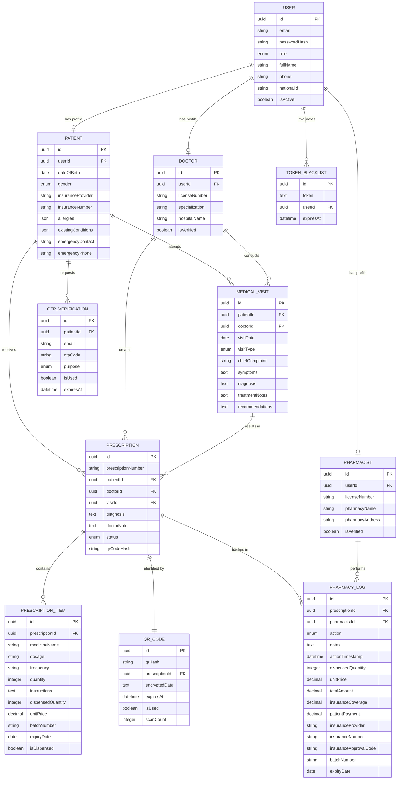
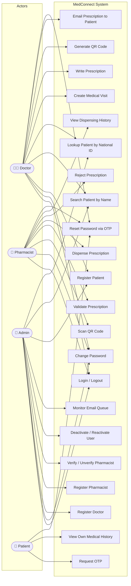
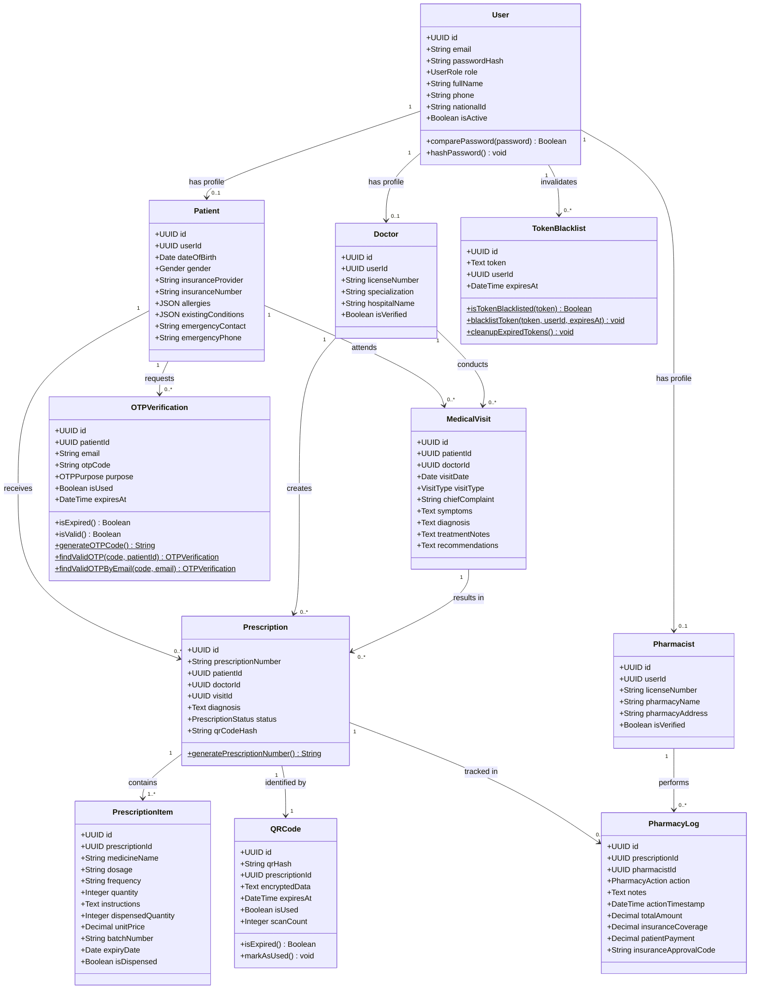
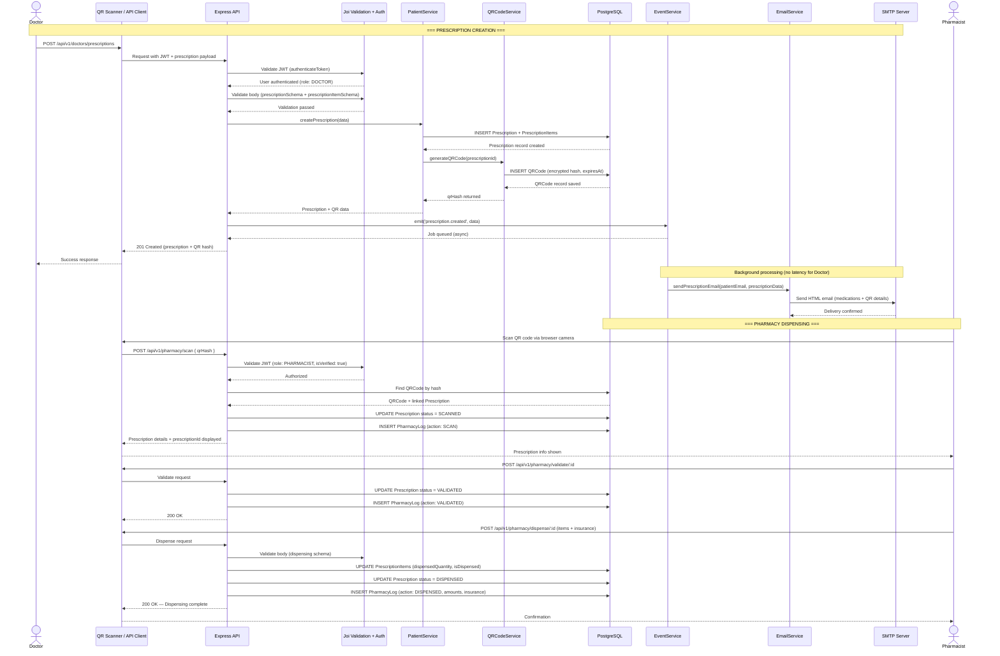
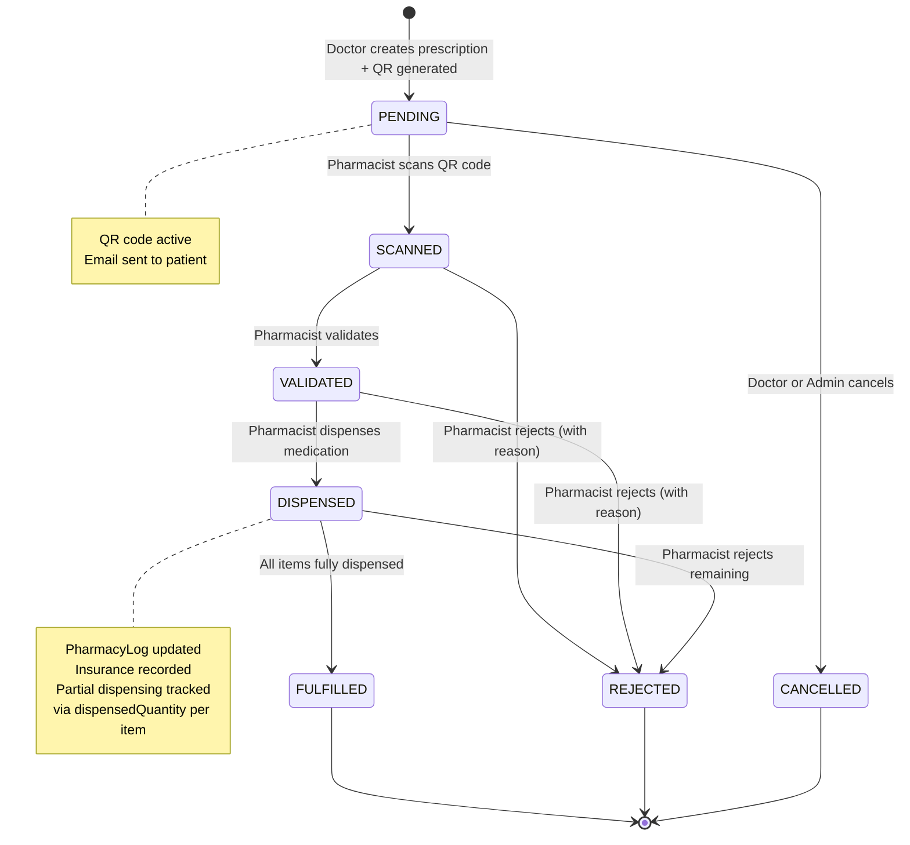
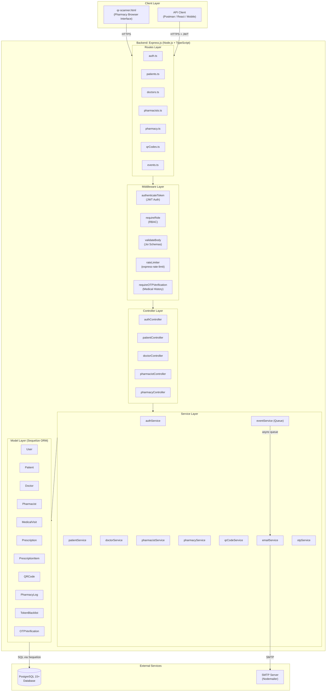

# SOFTWARE REQUIREMENTS SPECIFICATION
## MedConnect — Digital Prescription & Patient Records System

**Prepared by:** Cedrick Bienvenue
**Course:** Software Engineering
**Date:** January 23, 2026
**Version:** 2.0

---

## Revision History

| Name    | Date         | Reason For Changes                                              | Version |
|---------|--------------|-----------------------------------------------------------------|---------|
| Cedrick | Jan 23, 2026 | Initial SRS Draft including QR Security and NST2 alignment      | 1.0     |
| Cedrick | Mar 28, 2026 | Updated to reflect implemented system: Joi validation, 11-model ERD, full prescription lifecycle, National ID integration, OTP for medical history, token blacklist, rate limiting, corrected frontend scope | 2.0     |

---

## Table of Contents

1. Introduction
   - 1.1 Purpose
   - 1.2 Document Conventions
   - 1.3 Intended Audience and Reading Suggestions
   - 1.4 Product Scope
   - 1.5 References
2. Overall Description
   - 2.1 Product Perspective
   - 2.2 Product Functions
   - 2.3 User Classes and Characteristics
   - 2.4 Operating Environment
   - 2.5 Design and Implementation Constraints
   - 2.6 User Documentation
   - 2.7 Assumptions and Dependencies
3. External Interface Requirements
   - 3.1 User Interfaces
   - 3.2 Hardware Interfaces
   - 3.3 Software Interfaces
   - 3.4 Communications Interfaces
4. Requirement Specification
5. Other Nonfunctional Requirements
   - 5.1 Performance Requirements
   - 5.2 Safety Requirements
   - 5.3 Security Requirements
   - 5.4 Software Quality Attributes
   - 5.5 Business Rules
6. Appendix
   - Appendix A: Glossary
   - Appendix B: Analysis Models

---

## 1. Introduction

### 1.1 Purpose

This document specifies the software requirements for the MedConnect platform. It defines the functional and non-functional requirements, system features, interfaces, and constraints of the system. The SRS covers the entire MedConnect system, with a focus on digitizing prescriptions in Rwandan public health facilities to replace manual workflows.

### 1.2 Document Conventions

- Functional requirements are labeled as **FR**.
- Non-functional requirements are labeled as **NFR**.
- Technical terms are defined in the glossary.
- Requirements are written in clear, measurable statements.

### 1.3 Intended Audience and Reading Suggestions

This document is intended for:

- Developers and software engineers
- Project managers
- System testers
- Healthcare stakeholders
- Documentation writers

### 1.4 Product Scope

MedConnect is a digital management system for healthcare prescriptions. It reduces medication errors, prevents fraud, and provides searchable clinical histories. While it currently prioritizes email-based delivery to comply with RURA ICT regulations, the architecture is prepared for future government-level API integrations. The primary benefit is the transition from paper-based forgery-prone slips to a secure digital "source of truth."

### 1.5 References

- Ministry of Health, Rwanda. (2024). *Digital Health Strategic Plan (2020–2025)*. Kigali: Government Publications.
- Rwanda Food and Drugs Authority. (2023). *Guidelines for Electronic Prescribing and Dispensing*.
- World Health Organization. (2023). *Global Strategy on Digital Health 2020–2025*. Geneva: WHO Press.

---

## 2. Overall Description

### 2.1 Product Perspective

MedConnect is a new, self-contained system targeted at public sector healthcare facilities. It replaces physical patient ledgers and manual prescription slips and is designed with standardized RESTful hooks for future interoperability with national platforms like e-Ubuzima. It is a targeted solution for the "last mile" of clinical workflows.

### 2.2 Product Functions

- **User Authentication & Session Management:** Secure login for all roles, JWT-based sessions with token blacklisting on logout.
- **Visit Logging:** Recording clinical symptoms, diagnosis, visit type, and treatment notes for every clinical encounter.
- **QR-Secured Prescribing:** Creation of tamper-proof prescriptions with unique encrypted QR code identifiers.
- **Prescription Lifecycle Management:** Full state tracking from creation through scan, validation, dispensing, and fulfillment or rejection.
- **Identity Management:** Linking medical records to Rwanda National ID (Indangamuntu, 16 digits) across all user personas.
- **National ID-Based Patient Lookup:** Cross-hospital patient lookup using the national ID, accessible to verified clinical staff.
- **Pharmacy Verification & Dispensing:** Real-time QR scanning, prescription validation, itemized dispensing with insurance and billing details, and rejection with documented reasons.
- **OTP-Based Security:** One-Time Password verification for patient medical history access and password reset operations.
- **Email Notification System:** Event-driven background email queue dispatching prescription details and system notifications.
- **Rate-Limited API Access:** Protection of all critical endpoints against abuse via configurable rate limiting.
- **Administrative Oversight:** Admin-controlled user management, pharmacist verification, system event monitoring, and email queue management.

### 2.3 User Classes and Characteristics

- **Doctors:** Require fast clinical entry and full access to patient visit history. Can register patients, create medical visits, write prescriptions, and generate QR codes.
- **Pharmacists:** Require QR scanning capabilities, prescription validation, and dispensing log management. Only verified pharmacists may dispense.
- **Administrators:** Manage system configuration, user roles, security audits, doctor and pharmacist accounts, and the email event queue.
- **Patients:** Receive digital prescription notifications via secure email; access their own medical history after OTP verification.

### 2.4 Operating Environment

MedConnect is a web-based REST API system.

- **Client side:** The primary clinical interface is consumed via REST API clients. A lightweight QR scanner interface (`qr-scanner.html`) operates in modern web browsers (Chrome, Edge) on desktop PCs and Android/iOS tablets at pharmacy counters.
- **Server side:** Hosted on cloud infrastructure (Node.js v18+ environment) with a PostgreSQL 15+ database.

The software will operate in a web-based environment accessible via standard workstations (Windows/Linux) and Android-based tablets within the facility network.

### 2.5 Design and Implementation Constraints

- **Telecommunications Policy:** In accordance with Rwanda Utilities Regulatory Authority (RURA) Regulation No 013/2021, automated SMS features are restricted until a formal Sender ID is registered. The initial release is constrained to secure Email and system UI as primary notification channels.
- **Technology Stack:** The system is built using TypeScript and Node.js, with PostgreSQL serving as the primary relational database and Sequelize as the ORM.
- **Validation:** All inbound API data is validated using **Joi** schema validation (v18+).
- **Programming Standards:** Developers follow the camelCase naming convention across all backend entities and database schemas.
- **Security Standards:** Implementation uses secure HTTPS communication protocols and incorporates Role-Based Access Control (RBAC) to protect sensitive patient clinical data. JWT tokens are used for session management with a token blacklist for immediate invalidation.
- **Language Requirements:** The entire user interface, error messaging, and system documentation is provided exclusively in English.
- **Identity Standard:** All patient and staff records must include a Rwanda National ID (Indangamuntu) — a 16-digit numeric identifier — as the primary cross-facility identity field.

### 2.6 User Documentation

The following user documentation components will be delivered with the MedConnect system:

- **Online Help Modules:** Integrated contextual help within the system interface providing step-by-step guidance.
- **System User Manual:** A comprehensive document detailing all system functionalities, user roles, and data entry standards.
- **API Reference (Swagger/OpenAPI):** Interactive API documentation accessible at `/api-docs`, auto-generated from inline JSDoc annotations using swagger-jsdoc v6.

### 2.7 Assumptions and Dependencies

**Assumptions:**

- **Staff Digital Literacy:** Clinical staff possess a baseline level of digital literacy and will undergo standard orientation.
- **Institutional Infrastructure:** Public health facilities have access to a consistent power supply or UPS systems.
- **Patient Email Access:** Patients (or their legal guardians) have access to a valid email address to receive digital prescriptions.
- **National ID Availability:** All patients have or will be issued a Rwanda National ID (Indangamuntu). Babies and minors may be registered under a guardian's national ID until their own is issued.
- **Data Accuracy:** Initial data migrated into the system is accurate and provided by facility administration.

**Dependencies:**

- **Internet Connectivity:** MedConnect depends on stable 4G/fiber internet for cloud synchronization and real-time status updates.
- **Regulatory Approvals:** Ongoing operations depend on maintaining compliance with the Rwanda Food and Drugs Authority (RFDA).
- **Third-Party SMTP Services:** The system depends on a reliable SMTP service provider (Nodemailer-compatible) for automated email dispatch.
- **RURA Licensing:** Future SMS/USSD expansion depends on securing a registered Sender ID and a non-objection certificate from RURA.

---

## 3. External Interface Requirements

### 3.1 User Interfaces

The MedConnect system features:

- **REST API Interface:** The primary interface for all clinical operations, consumed by frontend clients. Returns JSON responses following a standardized `{ success, message, data }` structure.
- **Swagger UI (API Documentation):** Accessible at `/api-docs`, provides an interactive browser-based interface for all API endpoints.
- **QR Scanner Web Page (`/qr-scanner.html`):** A standalone, browser-based pharmacy interface for scanning QR codes via device camera and performing National ID-based patient lookups. Displays prescription ID and QR hash in a monospace, copyable format.

**GUI Standards:** The QR scanner interface follows a minimalist, high-contrast style to ensure readability under various hospital lighting conditions.

**Error Handling:** Error messages are standardized to be non-technical for clinical staff (e.g., "Invalid National ID" rather than "Database Constraint Error") and are returned in structured JSON error responses.

### 3.2 Hardware Interfaces

- **Device Types:** Supports standard x86-based PCs, laptops, and ARM-based Android/iOS tablets.
- **Peripheral Support:** Supports device cameras (via browser API) for QR code scanning at pharmacy counters.
- **Communication Protocols:** Hardware interactions managed via standard TCP/IP for networked devices.

### 3.3 Software Interfaces

| Component        | Technology                     | Version  | Purpose                                                        |
|------------------|--------------------------------|----------|----------------------------------------------------------------|
| Runtime          | Node.js                        | v18+     | Server-side JavaScript execution                               |
| Language         | TypeScript                     | ^5.2.2   | Type-safe backend development                                  |
| Framework        | Express.js                     | ^4.18.2  | HTTP routing and middleware                                    |
| Database         | PostgreSQL                     | v15+     | Relational data persistence                                    |
| ORM              | Sequelize                      | ^6.35.0  | Object-relational mapping                                      |
| Validation       | Joi                            | ^18.0.1  | Runtime schema validation of inbound clinical data             |
| Authentication   | jsonwebtoken                   | ^9.0.2   | JWT-based session management                                   |
| Password Hashing | bcryptjs                       | ^2.4.3   | Secure password storage                                        |
| QR Generation    | qrcode                         | ^1.5.3   | Encrypted QR code image generation                             |
| Email            | Nodemailer                     | ^8.0.4   | Automated email dispatch via SMTP                              |
| Rate Limiting    | express-rate-limit             | ^8.1.0   | API abuse prevention                                           |
| API Docs         | swagger-jsdoc + swagger-ui-express | ^6.2.8 / ^5.0.1 | Interactive API documentation                    |
| ID Generation    | uuid                           | ^9.0.1   | UUID primary key generation                                    |

### 3.4 Communications Interfaces

- **HTTPS:** Secure browser-to-server communication for all API traffic.
- **SMTP:** Automated email delivery of prescriptions and OTP codes via Nodemailer.
- **JWT Tokens:** Stateless session management with blacklist enforcement on logout.

---

## 4. Requirement Specification

### Stakeholder Requirements Specification

#### Functional Requirements

| Req ID | Requirement                          | Description                                                                                                                                                           |
|--------|--------------------------------------|-----------------------------------------------------------------------------------------------------------------------------------------------------------------------|
| FR 1   | User Authentication                  | Authenticate all users (Doctor, Pharmacist, Admin, Patient) using email and secure password. Sessions are managed via JWT tokens.                                      |
| FR 2   | Session Revocation                   | Maintain a token blacklist to immediately invalidate sessions upon logout or suspected breach.                                                                         |
| FR 3   | Visit Entry                          | Capture symptoms, diagnosis, visit type (Consultation, Emergency, Follow-up), and treatment notes for every clinical encounter.                                        |
| FR 4   | Digital Prescription                 | Generate medical orders containing medication name, dosage, frequency, quantity, and dispensing instructions per prescription item.                                    |
| FR 5   | QR Code Generation                   | Generate a unique, encrypted QR code for every finalized prescription. The QR hash is stored and tracked with scan count and expiry.                                   |
| FR 6   | Prescription Lifecycle Management    | Track prescription status through the complete lifecycle: PENDING → SCANNED → VALIDATED → DISPENSED → FULFILLED, or REJECTED / CANCELLED at any point.                |
| FR 7   | Email Notification                   | Dispatch prescription details (medication, dosage, QR code) to patient email addresses via an event-driven background queue. Also send OTP and welcome emails.         |
| FR 8   | Pharmacy QR Scan & Verification      | Allow pharmacists to scan/verify prescriptions via the QR scanner web interface. Scan action is logged in the PharmacyLog with timestamp and pharmacist ID.            |
| FR 9   | Pharmacy Dispensing                  | Allow verified pharmacists to dispense prescription items with itemized quantities, unit prices, batch numbers, expiry dates, insurance details, and approval codes.   |
| FR 10  | Prescription Rejection               | Allow verified pharmacists to reject a prescription with a documented reason. Rejected prescriptions are immutable.                                                    |
| FR 11  | National ID Patient Lookup           | Allow clinical staff to look up a patient record by their 16-digit Rwanda National ID (Indangamuntu) for cross-hospital access.                                        |
| FR 12  | OTP Verification                     | Require a 6-digit One-Time Password for: (a) patient self-access to their own medical history, and (b) password reset operations.                                      |
| FR 13  | Pharmacist Management                | Allow admins to register, update, verify, unverify, and delete pharmacist accounts. Only verified pharmacists may dispense prescriptions.                              |
| FR 14  | Doctor Management                    | Allow admins to register, update, and delete doctor accounts. Doctors must have a valid license number and specialization.                                              |
| FR 15  | Patient Registration                 | Allow doctors and admins to register patients with full medical profile: demographics, allergies, existing conditions, insurance details, and emergency contacts.       |
| FR 16  | Rate-Limited API Access              | Apply configurable rate limits to all critical endpoints (auth: 5/15min, OTP: 3/5min, QR scan: per-pharmacist, registration: 3/hour, etc.) to prevent abuse.          |
| FR 17  | Pharmacy Dispensing History          | Allow pharmacists to retrieve the full dispensing history and financial summary for any prescription they have processed.                                              |
| FR 18  | Admin Event Queue Management         | Allow admins to view the status of the background email queue and clear completed jobs.                                                                                |

---

## 5. Other Nonfunctional Requirements

### 5.1 Performance Requirements

| Req ID | Type                | Description                                                                                                                                        |
|--------|---------------------|----------------------------------------------------------------------------------------------------------------------------------------------------|
| NFR 1  | Response Time       | The system shall verify QR codes and retrieve patient records in less than 1.0 second under normal network conditions.                             |
| NFR 2  | Throughput          | The platform shall support at least 100 concurrent medical professionals per facility without degradation in API responsiveness.                    |
| NFR 3  | Resource Utilization| The QR scanner web interface shall be optimized for standard hospital hardware (low-spec PCs and Android tablets).                                 |
| NFR 4  | Email Queue         | Prescription email delivery shall be processed asynchronously in the background so that the prescription creation API response is not delayed.     |

### 5.2 Safety Requirements

| Req ID | Type               | Description                                                                                                                                              |
|--------|--------------------|----------------------------------------------------------------------------------------------------------------------------------------------------------|
| NFR 5  | Data Integrity     | Once a prescription reaches DISPENSED or FULFILLED status and a QR code is generated, the prescription record shall become immutable.                    |
| NFR 6  | Prescription Safety| All prescription items must include medication name, dosage, frequency, and quantity. The Rwanda FDA mandatory fields (brand/generic name, dosage strength, route) must be present. |
| NFR 7  | Failure Handling   | In the event of a network failure during an active visit, the system shall preserve draft state to prevent loss of clinical notes.                        |

### 5.3 Security Requirements

| Req ID | Type                   | Description                                                                                                                                                                    |
|--------|------------------------|--------------------------------------------------------------------------------------------------------------------------------------------------------------------------------|
| NFR 8  | Identity Authentication| All users authenticate via email and password. Sensitive operations (medical history access, password reset) require a 6-digit OTP sent to the user's verified email.          |
| NFR 9  | Role-Based Access      | RBAC enforces that only Doctors/Admins can create prescriptions, only verified Pharmacists can dispense, only Admins can manage staff accounts, and Patients access only their own data. |
| NFR 10 | Anti-Forgery           | Every prescription is tied to a unique encrypted QR hash. Pharmacists must scan this code to initiate verification. The QR code tracks scan count and expiry.                  |
| NFR 11 | Session Security       | JWT tokens are used for session management. A Token Blacklist table immediately invalidates sessions upon logout or suspected breach.                                           |
| NFR 12 | Input Validation       | All inbound API data is validated using Joi schemas before processing. Invalid requests are rejected with structured error messages at the API boundary.                        |
| NFR 13 | Rate Limiting          | Authentication: max 5 attempts per 15 minutes. OTP requests: max 3 per 5 minutes. Password reset: max 3 per hour. Registration: max 3 per hour. QR scan: pharmacist-level limits. |

### 5.4 Software Quality Attributes

| Req ID | Type              | Description                                                                                                                                              |
|--------|-------------------|----------------------------------------------------------------------------------------------------------------------------------------------------------|
| NFR 14 | Availability      | The system shall maintain 99.5% uptime during standard hospital operating hours.                                                                         |
| NFR 15 | Auditability      | Every action — visit creation, prescription signing, QR scan, dispensing, rejection — must be logged in the PharmacyLog with a timestamp and the performing user's ID. |
| NFR 16 | Usability         | The interface shall prioritize "ease of use" to ensure staff with limited technical expertise can navigate clinical workflows with minimal clicks.          |
| NFR 17 | Interoperability  | The system architecture follows RESTful standards to allow future secure data exchange with national platforms like e-Ubuzima.                            |
| NFR 18 | Maintainability   | The TypeScript codebase follows camelCase conventions and a layered architecture (Routes → Controllers → Services → Models) for long-term maintainability.|

### 5.5 Business Rules

- **Prescriber Authorization:** Only users with a verified "Doctor" role and an active license number are authorized to create and finalize prescriptions.
- **Dispensing Authority:** Only users with a verified "Pharmacist" role and `isVerified = true` can update a prescription status to DISPENSED or FULFILLED.
- **Identification Rule:** A patient record cannot be created without a valid full name, date of birth, and gender. A 16-digit Rwanda National ID (Indangamuntu) is recorded on the linked User account for cross-facility lookup.
- **Prescription Statuses:** Valid prescription statuses are: `PENDING` → `SCANNED` → `VALIDATED` → `DISPENSED` → `FULFILLED`, or `REJECTED` / `CANCELLED` at any stage. There is no "Partially Dispensed" status; partial dispensing is handled via `dispensedQuantity` at the item level.
- **QR Code One-Time Use:** A QR code scan triggers a state change (PENDING → SCANNED) and is logged. QR codes have an expiry date and a scan count.
- **Regulatory Compliance:** All digital prescriptions must contain the mandatory fields required by the Rwanda Food and Drugs Authority (RFDA): brand/generic name, dosage strength, frequency, quantity, and route of administration.
- **Insurance Handling:** Insurance provider and insurance number are optional fields on the patient record. During dispensing, pharmacists may record insurance coverage, patient payment, insurance approval code, and insurer details per dispensing event.

---

## 6. Appendix

### Appendix A: Glossary

| Term | Definition |
|------|------------|
| API | Application Programming Interface — a set of protocols for building and integrating application software. |
| camelCase | A naming convention where the first letter of each word is capitalized except for the first word. |
| e-Ubuzima | Rwanda's flagship national Electronic Medical Record (EMR) system. |
| RFDA | Rwanda Food and Drugs Authority. |
| Indangamuntu | Rwanda's National Identity Card. The 16-digit numeric ID is used as the primary cross-facility patient identifier in MedConnect. |
| Joi | A JavaScript/TypeScript schema validation library used in MedConnect to validate all inbound API data. |
| JWT | JSON Web Token — a secure method for representing claims transferred between two parties, used for session authentication. |
| NST2 | National Strategy for Transformation 2 — Rwanda's strategic development framework. |
| OTP | One-Time Password — a unique 6-digit code sent to a verified email for multi-factor authentication. |
| QR Code | Quick Response Code — a machine-readable code used in MedConnect to store encrypted prescription verification data. |
| RBAC | Role-Based Access Control — restricts system access based on user roles (Doctor, Pharmacist, Admin, Patient). |
| RURA | Rwanda Utilities Regulatory Authority. |
| Sequelize | A Node.js ORM used in MedConnect for PostgreSQL database interactions. |
| Token Blacklist | A database table that stores invalidated JWT tokens to immediately revoke sessions upon logout or breach. |
| UUID | Universally Unique Identifier — used as primary keys across all MedConnect database tables. |

---

### Appendix B: Analysis Models

---

#### 1. Entity-Relationship Diagram (ERD)

The MedConnect data model consists of **11 core entities**. The diagram below shows all tables, their key attributes, and the relationships between them.

**Explanation:**
- `USER` is the central authentication entity shared by all roles (Doctor, Pharmacist, Patient, Admin). The `nationalId` field stores the 16-digit Rwanda Indangamuntu for cross-facility lookup.
- `PATIENT`, `DOCTOR`, and `PHARMACIST` are role-specific profile tables linked to `USER` via a one-to-one relationship.
- Each `PRESCRIPTION` is tied to exactly one `QR_CODE` (1:1) and may contain many `PRESCRIPTION_ITEM` entries.
- `PHARMACY_LOG` records every pharmacy action (SCAN, VALIDATED, DISPENSED, FULFILLED, REJECTED) with full financial and insurance details.
- `TOKEN_BLACKLIST` immediately invalidates JWT sessions on logout.
- `OTP_VERIFICATION` supports two purposes: `medical_history_access` and `password_reset`.

---

#### 2. Use Case Diagram (Behavioral)

This diagram illustrates all functional interactions between the four system actors and the MedConnect platform.

**Explanation:**
- **Doctor** is the primary clinical actor: registers patients, records visits, and creates prescriptions with QR codes.
- **Pharmacist** handles the dispensing workflow: scans, validates, dispenses, or rejects prescriptions.
- **Admin** manages all staff accounts and monitors system health.
- **Patient** has limited self-service access: OTP-verified medical history viewing and password reset.

---

#### 3. Class Diagram (Structural)

This diagram represents the static structure of the backend models, their attributes, key methods, and relationships.

**Explanation:**
- `User` is the root authentication class; `Patient`, `Doctor`, and `Pharmacist` extend its identity via composition (not inheritance) through a foreign key.
- Static methods (`$`) on `Prescription`, `TokenBlacklist`, and `OTPVerification` encapsulate business logic at the model level.
- `QRCode` has a strict 1:1 relationship with `Prescription` — every finalized prescription gets exactly one QR code.

---

#### 4. Sequence Diagram (Behavioral) — Prescription Creation & Dispensing

This diagram tracks the full dynamic interaction across all system layers from prescription creation through pharmacy dispensing.

**Explanation:**
- The event-driven email queue ensures the Doctor's API response is instant — email delivery is handled asynchronously in the background.
- Joi validation blocks invalid payloads before any database operation occurs.
- The pharmacy workflow requires three explicit steps (Scan → Validate → Dispense) with a log entry at each stage.

---

#### 5. Prescription State Diagram

This diagram shows all valid prescription status transitions in MedConnect.

---

#### 6. Package Diagram (Structural)

This diagram illustrates the codebase organization and how the frontend, backend layers, and database depend on one another.

**Explanation:**
- **Client Layer:** The QR scanner HTML page is the only delivered frontend; all other consumers interact via the REST API.
- **Middleware Layer:** Every route passes through authentication, role enforcement, Joi validation, and rate limiting before reaching a controller.
- **Service Layer:** Business logic is fully separated from routing. `eventService` manages the async email queue, calling `emailService` in the background.
- **Model Layer:** 11 Sequelize models map to PostgreSQL tables. All primary keys are UUIDs.
- **External:** PostgreSQL for persistence; an SMTP provider for email delivery.
